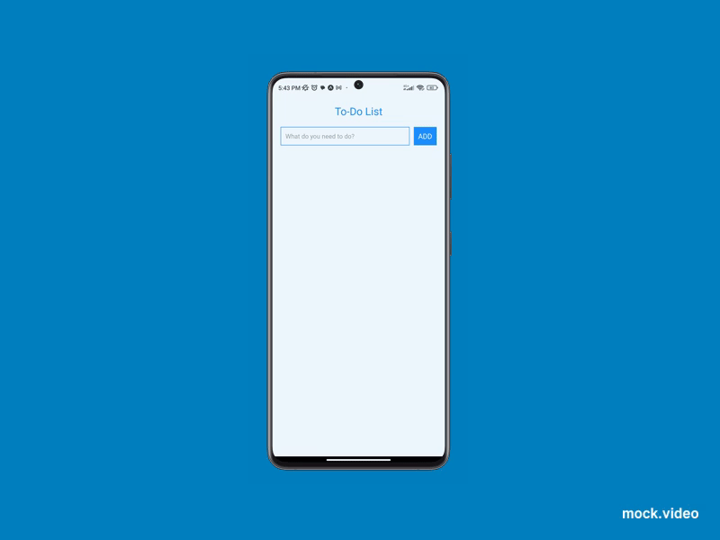

# 📝 Simple To-Do List App

A simple React Native app that allows users to add, view, and mark tasks as complete.

## 🚀 Features
- ✅ Add new tasks
- 🔄 Mark tasks as completed
- 📱 Responsive UI

---

## 📹 Demo Preview


> **Note:** If the video does not play, open the `mock.mp4` file manually.


---

## 🌍 Try it Online

Run the project directly in your browser using Expo Snack:

🔗 **[Live Preview on Expo Snack](https://snack.expo.dev/YOUR_SNACK_LINK)**

---

## 🛠 Installation

```sh
git clone https://github.com/kyriloswahid/SimpleTodoList.git
cd first_app

# 2. Install dependencies:
npm install

# 3. Start the development server:
npx expo start

# 4. Run on a mobile device:
# - Open the Expo Go app on your phone
# - Scan the QR code displayed in your terminal/browser

